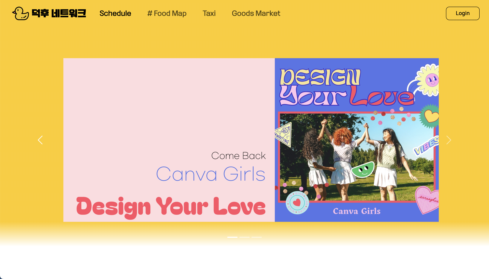
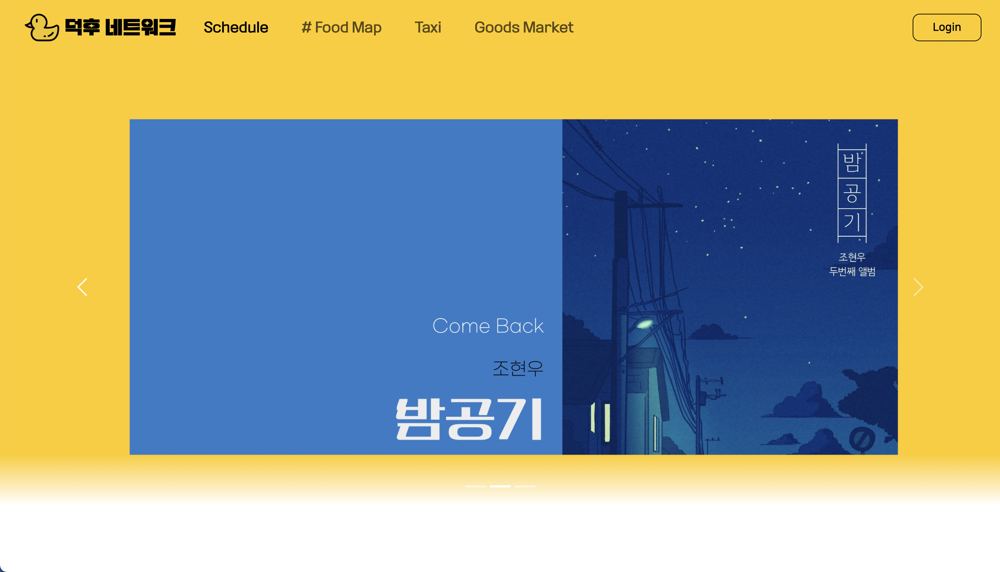
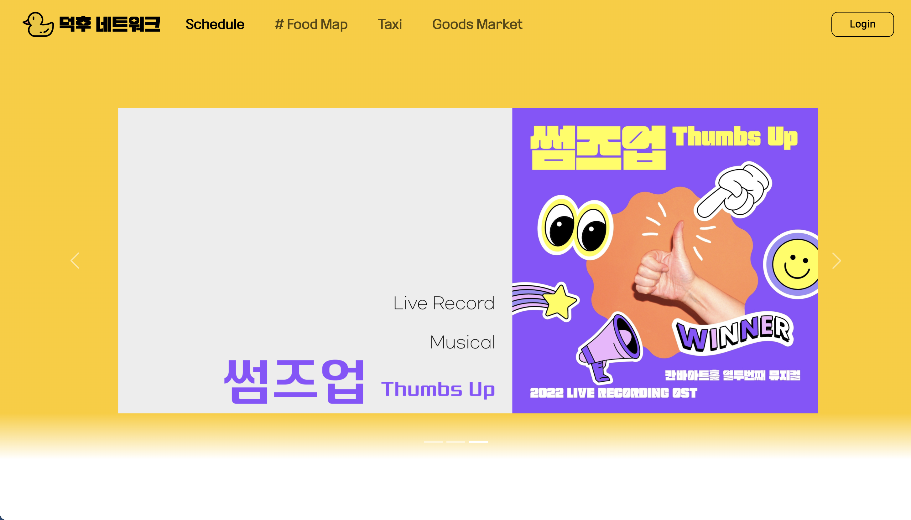
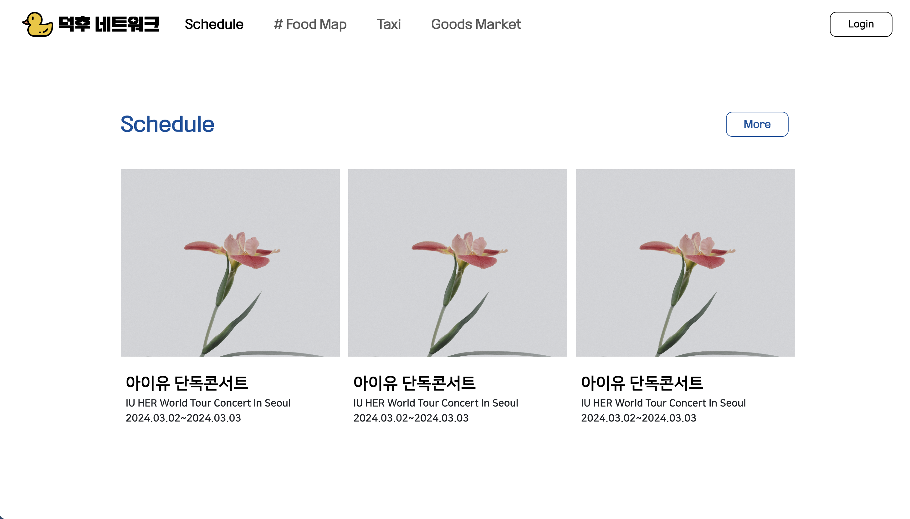
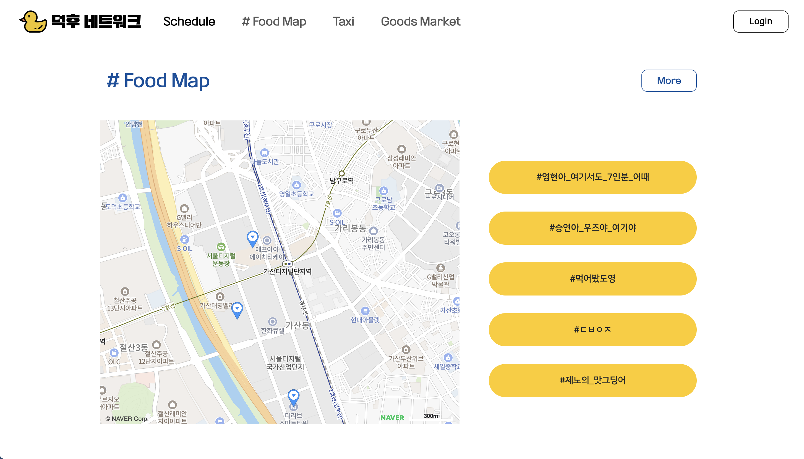
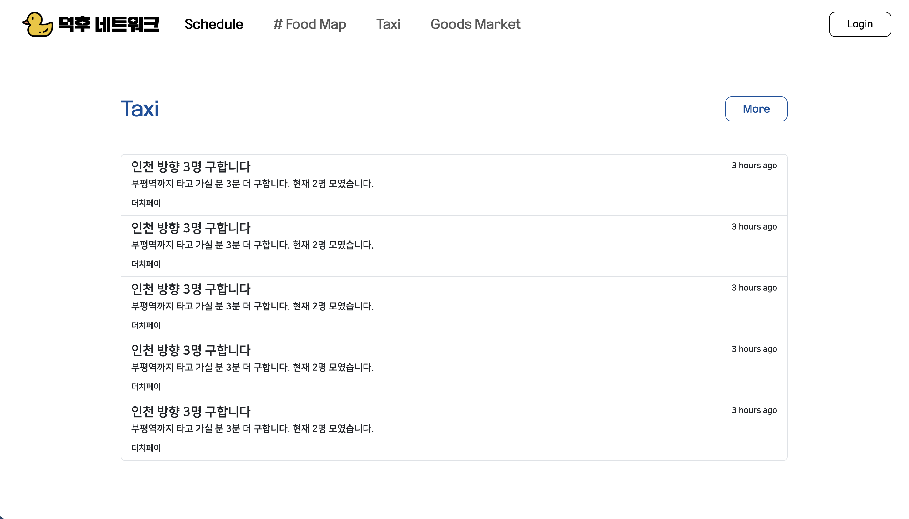
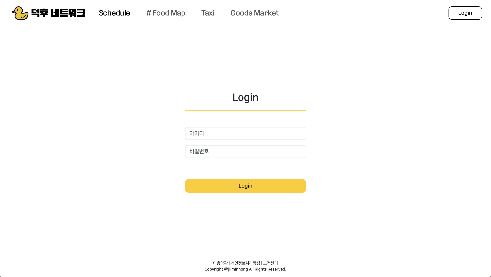
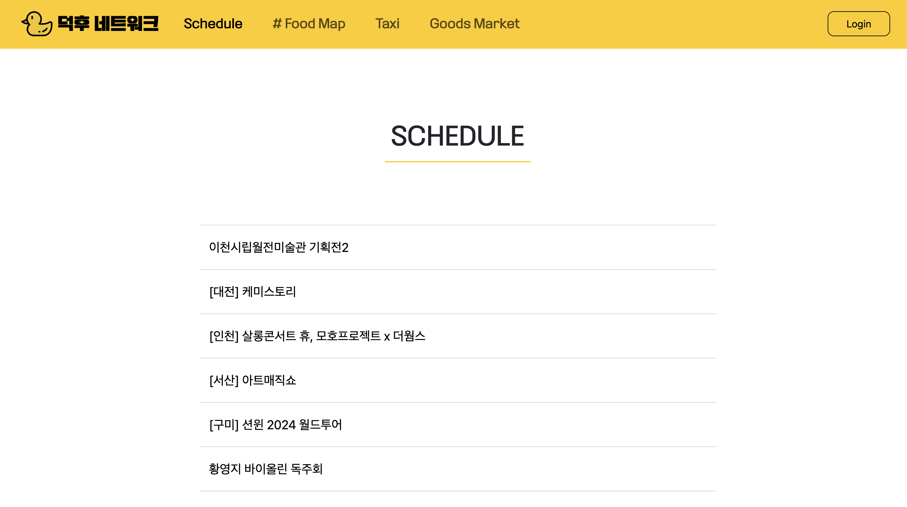
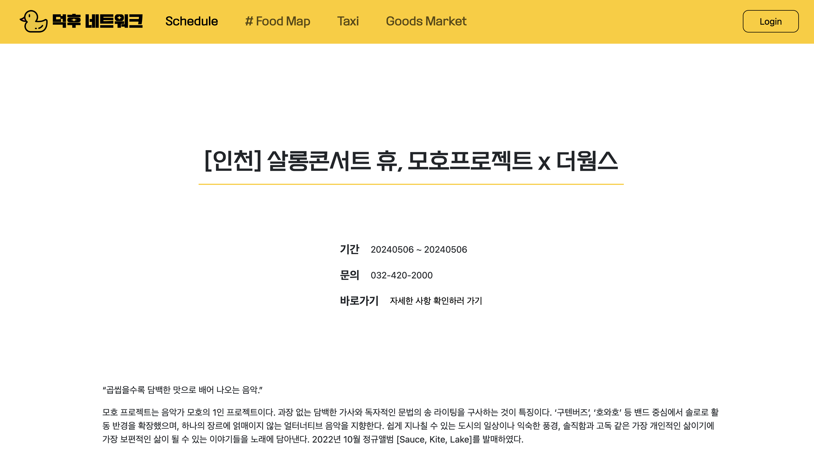

# DuckHooNetwork-ver2.0

덕후 네트워크 ver.2

#  덕후 네트워크 (DuckHooNetwork)

취미에 몰입한 '덕후'들을 위한 사이트로, 취미 생활을 진행함에 있어 도움을 제공하고자 제작되었습니다.
     

## 목차

- [개요](#개요)
- [작업물 설명](#작업물-설명)
       

## 개요

- 프로젝트 이름 : 덕후 네트워크 (DuckHooNetwork)
- 프로젝트 기간 : 2024.03.12 ~ 2024.03.21
- 사용 언어 및 도구 :      + Naver Map's Enterprise API

- 멤버 : 홍지민
       

## 작업물 설명

|  |  |  |
| :-------------------------------: | :-------------------------------: | :-------------------------------: |
| 메인 화면 (nav + header) 캐러셀1  | 메인 화면 (nav + header) 캐러셀2  | 메인 화면 (nav + header) 캐러셀3  |

- 캐러셀을 이용하여 자동으로 목록이 넘어가도록 제작
- 양쪽 화살표와 아래쪽 버튼을 클릭하면 해당 페이지에 맞는 캐러셀로 이동
    

|  |  |
| :-------------------------------: | :-------------------------------: |
|    메인 화면 (main - schedule)    |   메인 화면 (main - # food map)   |

- schedule 파트는 이미지와 제목에 링크 설정
- #food map 파트에서 지도는 naver api를 이용, 주요 맛집 핀 설정
    

|  |  |
| :-------------------------------: | :-------------------------------: |
|      메인 화면 (main - taxi)      |  메인 화면 (main - goods market)  |

- taxi 파트는 목록 배치
- goods market 파트는 card 이용
    

|   |
| :--------------------------------: |
|      메인 화면 (main - nav1)       |
|   |
|               :---:                |
|      메인 화면 (main - nav2)       |
|  |
|               :---:                |
|     메인 화면 (main - footer)      |

- nav는 header에서는 투명 상태, 일정 윈도우 사이즈 이하에서부터 배경색을 white로 변경
    

|       |
| :-------------------------------------: |
| 로그인 화면 (login - nav, main, footer) |

- 버튼 클릭 시 메인 화면으로 복귀
    
  
|  |  |
| :-------------------------------: | :-------------------------------: |
|      스케줄 화면 (schedule - main)      |  디테일 화면 (schedule - detail)  |

- rest api 데이터를 리스트로 생성, 추가
- 원하는 목록 클릭 시 해당 항목에 맞는 디테일 페이지로 이동
- 선택한 공연/전시의 자세한 사항 확인 가능
- 항목 인덱스에 따라 url 변경
       
